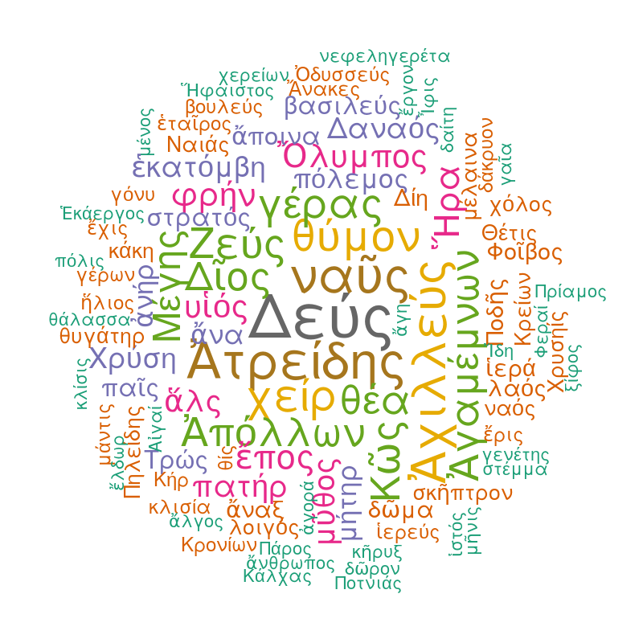
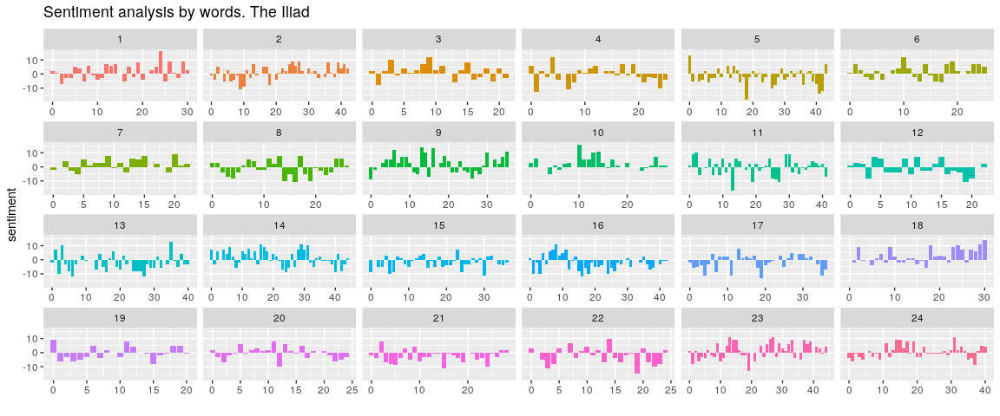
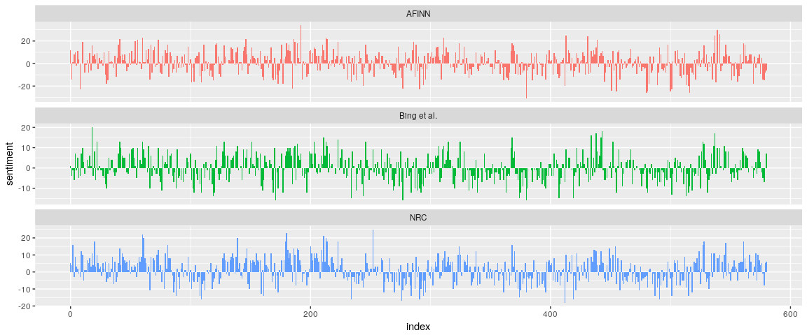
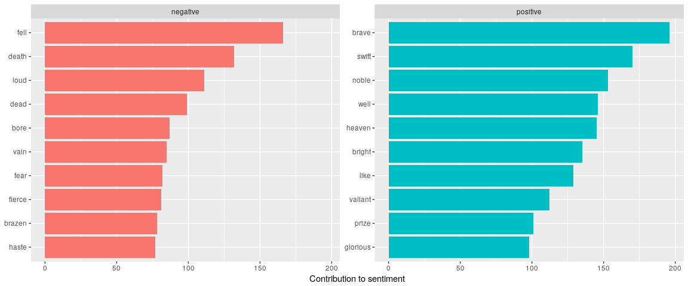
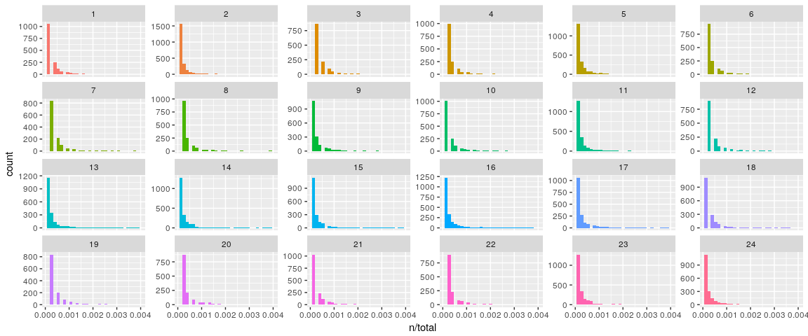
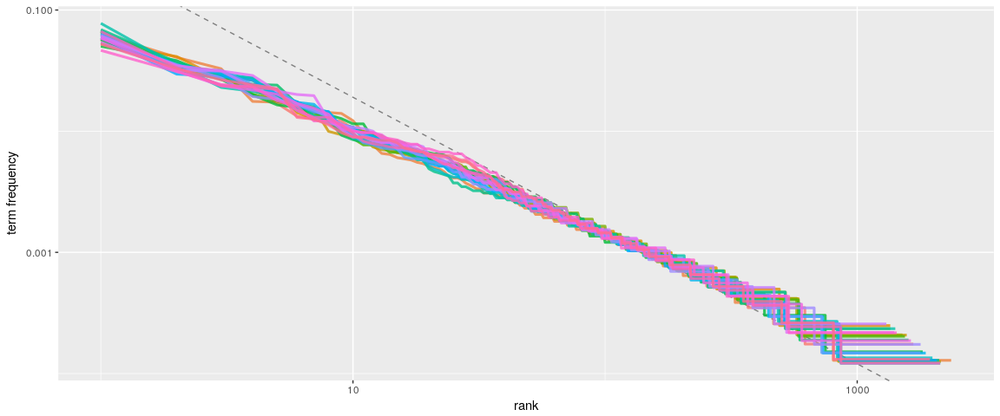
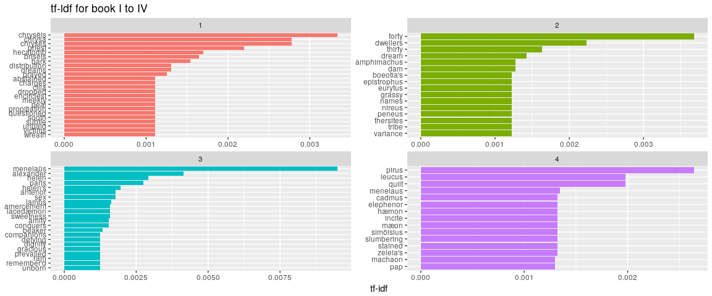
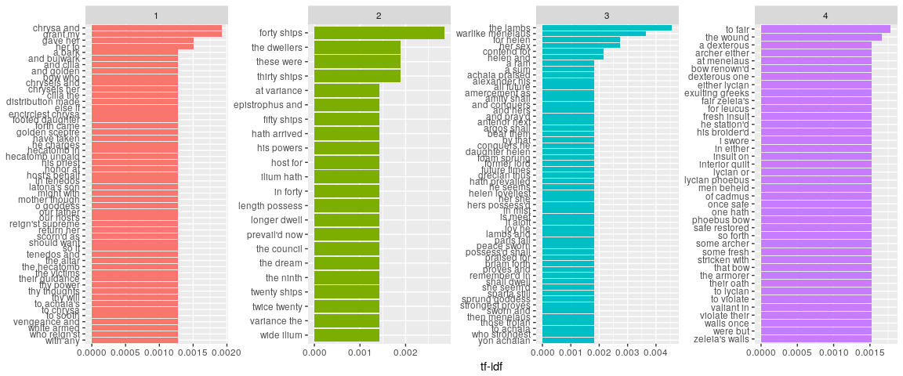

<style>
  .col1 {
    columns: 1 400px;         /* number of columns and width in pixels*/
    -webkit-columns: 1 400px; /* chrome, safari */
    -moz-columns: 1 400px;    /* firefox */
  }
  .col2 {
    columns: 2 200px;         /* number of columns and width in pixels*/
    -webkit-columns: 2 200px; /* chrome, safari */
    -moz-columns: 2 200px;    /* firefox */
  }
  .col3 {
    columns: 3 100px;
    -webkit-columns: 3 100px;
    -moz-columns: 3 100px;
  }
</style>


## Introduction

This project is an attempt to get familiarity with text mining in R and I haven't found a better way to get it that mining _The Iliad_. This familiarity with text mining can be very useful because "much of the data proliferating today is unstructured and text-heavy."[^1]

I've chosen the tidytext [^2] approach to text minig in order to test if it's so effective as the tidy familiy.

[^1]: Text Mining with R <https://www.tidytextmining.com/index.html>

[^2]: Tidytext <https://github.com/juliasilge/tidytext>

## Wordclouds

The first step in the process of mining _The Iliad_ is to know which words are more frequent in each book. _The Iliad_ is divided in 24 books. As a very basic learner of ancient greek I find interesting to do this using the classic greek version of the book.

So I used Perseus Digital Library [^3] catalog to access the original classic greek text of _The Iliad_ in XML version. As every classic greek learner should know this is a declinated language so the same word can appear in very different forms. To achieve a realistic count of every single greek word I've used Greek Word Study Tool [^4] to find the primal lemma of the declined word

Let's see the code:

```r
library(XML)
library(wordcloud)
library(RCurl)
library(httr)
library(RColorBrewer)

GetXmlChapter <- function(chapter=1,tipo="noun"){
  if(file.exists(paste0("chapter",chapter,".rds"))==FALSE){
    path <- "http://www.perseus.tufts.edu/hopper/xmlchunk?doc=Perseus%3Atext%3A1999.01.0133%3Abook%3D"
    path.c <- paste0(path,chapter)
    chapter.xml <- xmlParse(path.c)
    xml_data <- xmlToList(chapter.xml)
    nlineas <- length(xml_data$text$body$div1)
    lineas <- list()
    l <- 1
    for (i in 1:length(xml_data$text$body$div1)){
      lineas[[l]] <- LeeChunck(xml_data$text$body$div1[i])
      #print(LeeChunck(xml_data$text$body$div1[i]))
      l <- l+1
    }
    lineas <- unlist(lineas)
    #quitamos las comas
    lineas <- lapply(lineas, function(x) gsub(",","",x))
    lineas <- lapply(lineas, function(x) gsub('/.',"",x))
    lineas <- lapply(lineas, function(x) gsub(";","",x))
    lineas <- lapply(lineas, function(x) gsub("?","",x))
    lineas <- lapply(lineas, function(x) gsub(":","",x))
    lineas <- lapply(lineas, function(x) strsplit(x," ",))
    palabras <- unlist(lineas)
    #palabras <- sample(palabras,100)
    def <-  vector(mode="character", length=length(palabras))
    tipo <-  vector(mode="character", length=length(palabras))
    
    for (i in 1:length(palabras)){
      print(sprintf("%s:Traduciendo %s",i,palabras[i]))
      res <- try(GetWord(palabras[i]))
      if(class(res) == "try-error"){
        print("sleep an try again")
        Sys.sleep(1)
        res <- try(GetWord(palabras[i]))
        if(class(res) == "try-error"){
          print("sleep an try again")
          Sys.sleep(1)
          res <- try(GetWord(palabras[i]))
        }
      } 
      def[i] <- res[[1]]
      tipo[i] <- res[[2]]
    }
    res <- cbind(palabras,def,tipo)
    saveRDS(res,file = paste0("chapter",chapter,".rds"))
  }
  res <- readRDS(file = paste0("chapter",chapter,".rds") )
  res <- res[res[,3]==tipo,]
  summary <- as.data.frame(table(res[,2]))
  png(paste0("wordcloud_chapter",chapter,".png"), width=800, height=800, res=300)
  wordcloud(summary$Var1,summary$Freq,colors=brewer.pal(8, "Dark2"),random.order=FALSE,rot.per=0.35,scale=c(1.5,0.3), use.r.layout=FALSE,  max.words=100)
  dev.off()
  #return(g)
}

GetWord <- function(word){
  gc()
  if (word==""){
    return(list(NA,NA))
  }
  word.html <- NULL
  path <- sprintf("http://www.perseus.tufts.edu/hopper/morph?lang=greek&lookup=%s",word)
  #word.html <- htmlTreeParse(path,encoding = "UTF-8")
  while (is.null(word.html)){
    Sys.sleep(0.1)
    tabs <- GET(path)
    word.html <- htmlTreeParse(tabs,encoding = "UTF-8")
    if (!is.null(word.html$children)){
      if (grepl("503",word.html$children)){
          return(c(word,NA))
        }
      }
    }
  word.html <- xmlToList(word.html$children$html)
  
  if (word.html$body[2]$div[2]$div[2]$div[[1]]!="Sorry, no information was found for"){
    def <- word.html$body[2]$div[2]$div[2]$div[1]$div$div$div[3]
    if (!is.null(def)){
      tipo <- strsplit(word.html$body[2]$div[2]$div[2]$div$div$div[3]$table[2,1][[1]]," ")[[1]][1]
    } else {
      tipo <- NA
    }
    lemma <- word.html$body[2]$div[2]$div[2]$div[1]$div$div$div[1]
    if (class(lemma)=="list"){
      Encoding(lemma[[1]]) <- "UTF-8"
      return(list(lemma[[1]],tipo))
    } else {
      if(is.null(def)){
        return(list(word,NA))
      } else {
        Encoding(lemma) <- "UTF-8"
        return(list(lemma,tipo))
      }
    } 
  } else {
    print("Informacion no encontrada")
    return(list(NA,NA))
  }
  Encoding(lemma) <- "UTF-8"
  return(list(lemma,tipo))
}

LeeChunck <- function(chunck){
  lineas <- list()
  l <- 1
  #es una linea
  if (names(chunck)=="l"){
    #cin milestone
    if ("milestone" %in% names(chunck$l)){
      linea <- chunck$l$text
      lineas[[l]] <- linea
      l <- l+1
    } else {
      if ("text" %in% names(chunck$l)){
        linea <- chunck$l$text
        lineas[[l]] <- linea
        l <- l+1
      } else {
        linea <- chunck$l
        lineas[[l]] <- linea
        l <- l+1
      }
    }
  }
  # es un parrafo
  if (names(chunck)=="q"){
    #todos los chunkitos
    for (i in 1:length(chunck$q)){
      l2 <- LeeChunck(chunck$q[i])
      lineas[[l]] <- l2
      l <- l+1
    }
    
  }
  
  lineas <- unlist(lineas)
  return(lineas)
}
```

And let's see some results
<div class="col2">


</div>

[^3]: Perseus Digital Library <http://www.perseus.tufts.edu/hopper/>

[^4]: Perseus Digital Library Greek Word Study Tool <http://www.perseus.tufts.edu/hopper/morph?lang=greek&lookup=%E1%BC%A1>

## Text Mining

In this chapter I am replicating the analysys made in _Text Mining with R_ [^5] and aplying them to _The Iliad_.

### Getting and cleaning the text

The dirty job, to this analysys the cleanest text of the book was needed. After a bit of web searching I've found in _Gutenberg Project_[^5] [this version] (http://www.gutenberg.org/cache/epub/16452/pg16452.txt), although this is the cleanest text I've found it's is not clean at all; so you need a lot of cleaning.


```r
library(dplyr)
library(tidytext)
library(tidyr)
library(ggplot2)

  con <- file("http://www.gutenberg.org/cache/epub/16452/pg16452.txt",open="r")
  lines <- readLines(con)
  lines.split <- vector("integer",24)
  for (book in 1:24){
    search <- sprintf("BOOK %s\\.",as.roman(book))
    lines.split[book] <- last(which(grepl(search,lines)==TRUE)) #porque la primera vez que aparece es el índice
  }
  final <- '                  \\*       \\*       \\*       \\*       \\*'
  libros <- vector("list",24)
  for (l in 1:24){
    if (l!=24){
      libros[[l]] <- lines[(lines.split[l]+1):(lines.split[(l+1)]-1)]
    } else {
      libros[[l]] <- lines[(lines.split[l]+1):length(lines)]
    }
    #hay final de linea
    if (TRUE %in% grepl(final,libros[[l]])){
      libros[[l]] <- libros[[l]][1:(which(grepl(final,libros[[l]])==TRUE)-1)]
    }
    #si hay ARGUMENT
    if (TRUE %in% grepl("ARGUMENT",libros[[l]])){
      libros[[l]] <- libros[[l]][1:(which(grepl("ARGUMENT",libros[[l]])==TRUE)-1)]
    }
  }
```

```
## Warning in 1:(which(grepl("ARGUMENT", libros[[l]]) == TRUE) - 1): numerical
## expression has 8 elements: only the first used
```

```
## Warning in 1:(which(grepl("ARGUMENT", libros[[l]]) == TRUE) - 1): numerical
## expression has 2 elements: only the first used
```

```r
  #Vamos a limpiar todos los libros
  #Borro líneas vacías
  libros <- lapply(libros,FUN = function(x) x[x!=""])
  #Borro números
  libros <- lapply(libros,FUN = function(x) gsub('[0-9]+', '', x))
  #Borro lineas sueltas
  libros <- lapply(libros,FUN = function(x) x[!(grepl("THE ILIAD.",x))])
  libros <- lapply(libros,FUN = function(x) x[!(grepl("BOOK",x))])
  #Borro los corchetes de las notas
  libros <- lapply(libros,FUN = function(x) gsub('\\[|\\]+', '', x))
  #Borro cuando hay más de un espacio
  libros <- lapply(libros,FUN = function(x) gsub("\\s\\s+","",x))
```

After this hard cleaning job I get a list (one element for book) of vectors (one element for line).


```r
head(libros[[1]])
```

```
## [1] "Achilles sing, O Goddess! Peleus' son;"     
## [2] "His wrath pernicious, who ten thousand woes"
## [3] "Caused to Achaia's host, sent many a soul"  
## [4] "Illustrious into Ades premature,"           
## [5] "And Heroes gave (so stood the will of Jove)"
## [6] "To dogs and to all ravening fowls a prey,"
```

*The tidy text format*: tidy text format breaks the text in individual tokens and transforms it to a tidy data structure using _unnest_tokens()_.

```r
library(tidytext)
library(formattable)
libros.df <- lapply(libros,FUN=function(x) data.frame(line=1:length(x),text=x))
libros.df <- lapply(libros.df,FUN=function(x) x %>% unnest_tokens(word,text))
  for (i in 1:length(libros.df)){
    libros.df[[i]]$book <- i
  }
libros.df <- bind_rows(libros.df)
head(libros.df)
```

```
##   line     word book
## 1    1 achilles    1
## 2    1     sing    1
## 3    1        o    1
## 4    1  goddess    1
## 5    1   peleus    1
## 6    1      son    1
```

### Word frequencies

```r
freq <- libros.df %>% anti_join(stop_words) %>% group_by(book) %>% count(word,sort=TRUE) %>% group_by(book)
```

```
## Joining, by = "word"
```

```r
freq <- split(freq,freq$book) 
freq10 <- lapply(freq, FUN=function(x) x[1:10,])
```

<div class="col3">

```r
formattable(freq10[[1]])
```


<table class="table table-condensed">
 <thead>
  <tr>
   <th style="text-align:right;"> book </th>
   <th style="text-align:right;"> word </th>
   <th style="text-align:right;"> n </th>
  </tr>
 </thead>
<tbody>
  <tr>
   <td style="text-align:right;"> 1 </td>
   <td style="text-align:right;"> thou </td>
   <td style="text-align:right;"> 57 </td>
  </tr>
  <tr>
   <td style="text-align:right;"> 1 </td>
   <td style="text-align:right;"> thy </td>
   <td style="text-align:right;"> 55 </td>
  </tr>
  <tr>
   <td style="text-align:right;"> 1 </td>
   <td style="text-align:right;"> thee </td>
   <td style="text-align:right;"> 34 </td>
  </tr>
  <tr>
   <td style="text-align:right;"> 1 </td>
   <td style="text-align:right;"> son </td>
   <td style="text-align:right;"> 25 </td>
  </tr>
  <tr>
   <td style="text-align:right;"> 1 </td>
   <td style="text-align:right;"> jove </td>
   <td style="text-align:right;"> 24 </td>
  </tr>
  <tr>
   <td style="text-align:right;"> 1 </td>
   <td style="text-align:right;"> achilles </td>
   <td style="text-align:right;"> 22 </td>
  </tr>
  <tr>
   <td style="text-align:right;"> 1 </td>
   <td style="text-align:right;"> host </td>
   <td style="text-align:right;"> 20 </td>
  </tr>
  <tr>
   <td style="text-align:right;"> 1 </td>
   <td style="text-align:right;"> gods </td>
   <td style="text-align:right;"> 16 </td>
  </tr>
  <tr>
   <td style="text-align:right;"> 1 </td>
   <td style="text-align:right;"> agamemnon </td>
   <td style="text-align:right;"> 15 </td>
  </tr>
  <tr>
   <td style="text-align:right;"> 1 </td>
   <td style="text-align:right;"> apollo </td>
   <td style="text-align:right;"> 15 </td>
  </tr>
</tbody>
</table>

```r
formattable(freq10[[2]])
```


<table class="table table-condensed">
 <thead>
  <tr>
   <th style="text-align:right;"> book </th>
   <th style="text-align:right;"> word </th>
   <th style="text-align:right;"> n </th>
  </tr>
 </thead>
<tbody>
  <tr>
   <td style="text-align:right;"> 2 </td>
   <td style="text-align:right;"> ships </td>
   <td style="text-align:right;"> 36 </td>
  </tr>
  <tr>
   <td style="text-align:right;"> 2 </td>
   <td style="text-align:right;"> son </td>
   <td style="text-align:right;"> 32 </td>
  </tr>
  <tr>
   <td style="text-align:right;"> 2 </td>
   <td style="text-align:right;"> jove </td>
   <td style="text-align:right;"> 29 </td>
  </tr>
  <tr>
   <td style="text-align:right;"> 2 </td>
   <td style="text-align:right;"> thou </td>
   <td style="text-align:right;"> 24 </td>
  </tr>
  <tr>
   <td style="text-align:right;"> 2 </td>
   <td style="text-align:right;"> led </td>
   <td style="text-align:right;"> 22 </td>
  </tr>
  <tr>
   <td style="text-align:right;"> 2 </td>
   <td style="text-align:right;"> chief </td>
   <td style="text-align:right;"> 20 </td>
  </tr>
  <tr>
   <td style="text-align:right;"> 2 </td>
   <td style="text-align:right;"> troy </td>
   <td style="text-align:right;"> 20 </td>
  </tr>
  <tr>
   <td style="text-align:right;"> 2 </td>
   <td style="text-align:right;"> host </td>
   <td style="text-align:right;"> 19 </td>
  </tr>
  <tr>
   <td style="text-align:right;"> 2 </td>
   <td style="text-align:right;"> agamemnon </td>
   <td style="text-align:right;"> 18 </td>
  </tr>
  <tr>
   <td style="text-align:right;"> 2 </td>
   <td style="text-align:right;"> king </td>
   <td style="text-align:right;"> 16 </td>
  </tr>
</tbody>
</table>

```r
formattable(freq10[[3]])
```


<table class="table table-condensed">
 <thead>
  <tr>
   <th style="text-align:right;"> book </th>
   <th style="text-align:right;"> word </th>
   <th style="text-align:right;"> n </th>
  </tr>
 </thead>
<tbody>
  <tr>
   <td style="text-align:right;"> 3 </td>
   <td style="text-align:right;"> thou </td>
   <td style="text-align:right;"> 26 </td>
  </tr>
  <tr>
   <td style="text-align:right;"> 3 </td>
   <td style="text-align:right;"> thy </td>
   <td style="text-align:right;"> 19 </td>
  </tr>
  <tr>
   <td style="text-align:right;"> 3 </td>
   <td style="text-align:right;"> paris </td>
   <td style="text-align:right;"> 16 </td>
  </tr>
  <tr>
   <td style="text-align:right;"> 3 </td>
   <td style="text-align:right;"> helen </td>
   <td style="text-align:right;"> 15 </td>
  </tr>
  <tr>
   <td style="text-align:right;"> 3 </td>
   <td style="text-align:right;"> thee </td>
   <td style="text-align:right;"> 15 </td>
  </tr>
  <tr>
   <td style="text-align:right;"> 3 </td>
   <td style="text-align:right;"> ye </td>
   <td style="text-align:right;"> 14 </td>
  </tr>
  <tr>
   <td style="text-align:right;"> 3 </td>
   <td style="text-align:right;"> troy </td>
   <td style="text-align:right;"> 13 </td>
  </tr>
  <tr>
   <td style="text-align:right;"> 3 </td>
   <td style="text-align:right;"> menelaus </td>
   <td style="text-align:right;"> 12 </td>
  </tr>
  <tr>
   <td style="text-align:right;"> 3 </td>
   <td style="text-align:right;"> menelaüs </td>
   <td style="text-align:right;"> 12 </td>
  </tr>
  <tr>
   <td style="text-align:right;"> 3 </td>
   <td style="text-align:right;"> fair </td>
   <td style="text-align:right;"> 11 </td>
  </tr>
</tbody>
</table>
</div>

### Sentiment analysis

As it is said in _Text Mining with R_ "One way to analyze the sentiment of a text is to consider the text as a combination of its individual words and the sentiment content of the whole text as the sum of the sentiment content of the individual words. ", probably a wrong method anyway.


```r
sentiments <- libros.df %>% inner_join(get_sentiments("bing")) %>% count(book,index = line %/% 25, sentiment) %>% spread(sentiment, n, fill = 0) %>%  mutate(sentiment = positive - negative)
```

```
## Joining, by = "word"
```

```r
ggplot(sentiments, aes(index, sentiment, fill = as.factor(book))) +
    geom_col(show.legend = FALSE) +
    facet_wrap(~book, ncol = 6, scales = "free_x") + labs(title="Sentiment analysis by words. The Iliad") + xlab("")
```

<!-- -->

As can be seen the overall sentiment of the book is quite negative, for example book XXI is significantly negative. The summary of the chapter in [Wikipedia](https://en.wikipedia.org/wiki/Iliad#Synopsis) is "Driving the Trojans before him, Achilles cuts off half their number in the river Skamandros and proceeds to slaughter them, filling the river with the dead. The river, angry at the killing, confronts Achilles but is beaten back by Hephaestus' firestorm. The gods fight among themselves. The great gates of the city are opened to receive the fleeing Trojans, and Apollo leads Achilles away from the city by pretending to be a Trojan.", can it bee positive?

### Comparing the three sentiment dictionaries


```r
libros.df$line2 <- 1:nrow(libros.df)
  afinn <- libros.df %>% 
    inner_join(get_sentiments("afinn")) %>% 
    group_by(index = line2 %/% 250) %>% 
    summarise(sentiment = sum(score)) %>% 
    mutate(method = "AFINN")
```

```
## Joining, by = "word"
```

```r
  bing_and_nrc <- bind_rows(libros.df %>% 
                              inner_join(get_sentiments("bing")) %>%
                              mutate(method = "Bing et al."),
                            libros.df %>% 
                              inner_join(get_sentiments("nrc") %>% 
                                           dplyr::filter(sentiment %in% c("positive", 
                                                                   "negative"))) %>%
                              mutate(method = "NRC")) %>%
    count(method, index = line2 %/% 250, sentiment) %>%
    spread(sentiment, n, fill = 0) %>%
    mutate(sentiment = positive - negative)
```

```
## Joining, by = "word"
## Joining, by = "word"
```

```r
  bind_rows(afinn, 
            bing_and_nrc) %>%
    ggplot(aes(index, sentiment, fill = method)) +
    geom_col(show.legend = FALSE) +
    facet_wrap(~method, ncol = 1, scales = "free_y")
```

<!-- -->

The three sentiments sources are coherent.

### Most common positive and negative words


```r
bing_word_counts <- libros.df %>%
    inner_join(get_sentiments("bing")) %>%
    count(word, sentiment, sort = TRUE) %>%
    ungroup()
```

```
## Joining, by = "word"
```

```r
  bing_word_counts %>%
    group_by(sentiment) %>%
    top_n(10) %>%
    ungroup() %>%
    mutate(word = reorder(word, n)) %>%
    ggplot(aes(word, n, fill = sentiment)) +
    geom_col(show.legend = FALSE) +
    facet_wrap(~sentiment, scales = "free_y") +
    labs(y = "Contribution to sentiment",
         x = NULL) +
    coord_flip()
```

```
## Selecting by n
```

<!-- -->

The list of positive words is quite interesting with several words in the circle of [ἀρετή](https://en.wikipedia.org/wiki/Arete): brave, noble, brigth, valiant, glorious.

### Term frequency, Zipf's law and bind_tf_idf function


```r
book_words <- libros.df %>%
    count(book, word, sort = TRUE) %>%
    ungroup()
  
  total_words <- book_words %>% 
    group_by(book) %>% 
    summarize(total = sum(n))
  
  book_words <- left_join(book_words, total_words)
```

```
## Joining, by = "book"
```

```r
  ggplot(book_words, aes(n/total, fill = as.factor(book))) +
    geom_histogram(show.legend = FALSE) +
    xlim(NA, 0.004) +
    facet_wrap(~book, ncol = 6, scales = "free_y")
```

```
## `stat_bin()` using `bins = 30`. Pick better value with `binwidth`.
```

```
## Warning: Removed 769 rows containing non-finite values (stat_bin).
```

```
## Warning: Removed 24 rows containing missing values (geom_bar).
```

<!-- -->

```r
  freq_by_rank <- book_words %>% 
    group_by(book) %>% 
    mutate(rank = row_number(), 
           `term frequency` = n/total)
  
  freq_by_rank %>% 
    ggplot(aes(rank, `term frequency`, color = as.factor(book))) + 
    geom_abline(intercept = -0.62, slope = -1.1, color = "gray50", linetype = 2) +
    geom_line(size = 1.1, alpha = 0.8, show.legend = FALSE) + 
    scale_x_log10() +
    scale_y_log10()
```

<!-- -->

```r
  rank_subset <- freq_by_rank %>% 
    dplyr::filter(rank < 500,
           rank > 10)
  
  lm(log10(`term frequency`) ~ log10(rank), data = rank_subset)
```

```
## 
## Call:
## lm(formula = log10(`term frequency`) ~ log10(rank), data = rank_subset)
## 
## Coefficients:
## (Intercept)  log10(rank)  
##     -1.0909      -0.8772
```

```r
    book_words <- book_words %>%
    bind_tf_idf(word, book, n)
  book_words
```

```
## # A tibble: 41,939 x 7
##     book word      n total     tf   idf tf_idf
##    <int> <chr> <int> <int>  <dbl> <dbl>  <dbl>
##  1    14 the     549  8234 0.0667     0      0
##  2    23 the     547  8223 0.0665     0      0
##  3    11 the     535  7757 0.0690     0      0
##  4     2 the     494  7779 0.0635     0      0
##  5    13 the     475  7420 0.0640     0      0
##  6    16 the     462  7778 0.0594     0      0
##  7     5 the     458  7956 0.0576     0      0
##  8    17 the     424  6738 0.0629     0      0
##  9    15 the     420  6773 0.0620     0      0
## 10    24 the     399  7621 0.0524     0      0
## # ... with 41,929 more rows
```

```r
  book_words %>%
    select(-total) %>%
    arrange(desc(tf_idf))
```

```
## # A tibble: 41,939 x 6
##     book word            n      tf   idf  tf_idf
##    <int> <chr>       <int>   <dbl> <dbl>   <dbl>
##  1    10 dolon          16 0.00303 3.18  0.00961
##  2     3 menelaüs       12 0.00299 3.18  0.00949
##  3     6 bellerophon     8 0.00167 3.18  0.00530
##  4     3 alexander       8 0.00199 2.08  0.00414
##  5    13 deiphobus      14 0.00189 2.08  0.00392
##  6     7 idæus           9 0.00212 1.79  0.00379
##  7    24 litter          9 0.00118 3.18  0.00375
##  8     2 forty           9 0.00116 3.18  0.00368
##  9    16 patroclus      52 0.00669 0.539 0.00360
## 10     1 chrysëis        6 0.00105 3.18  0.00334
## # ... with 41,929 more rows
```

```r
  book_words %>%
    arrange(desc(tf_idf)) %>%
    dplyr::filter(book<=4) %>% 
    mutate(word = factor(word, levels = rev(unique(word)))) %>% 
    group_by(book) %>% 
    top_n(15) %>% 
    ungroup %>%
    ggplot(aes(word, tf_idf, fill = as.factor(book))) +
    geom_col(show.legend = FALSE) +
    labs(x = NULL, y = "tf-idf",title="tf-idf for book I to IV") +
    facet_wrap(~book, ncol = 2, scales = "free") +
    coord_flip()
```

```
## Selecting by tf_idf
```

<!-- -->

### Relations between words

#### Bigrams


```r
  libros.df_2 <- lapply(libros,FUN=function(x) data.frame(line=1:length(x),text=x))
  libros.df_2 <- lapply(libros.df_2,FUN=function(x) x %>% unnest_tokens(bigram,text,token="ngrams",n=2))
  for (i in 1:length(libros.df_2)){
    libros.df_2[[i]]$book <- i
  }
  iliad_bigrams <- bind_rows(libros.df_2)
  
  iliad_bigrams %>%
    count(bigram, sort = TRUE)
```

```
## # A tibble: 64,434 x 2
##    bigram       n
##    <chr>    <int>
##  1 of the     574
##  2 to the     459
##  3 on the     353
##  4 and the    329
##  5 in the     319
##  6 from the   305
##  7 of all     212
##  8 all the    206
##  9 son of     205
## 10 to his     205
## # ... with 64,424 more rows
```

```r
  bigrams_separated <- iliad_bigrams %>%
    separate(bigram, c("word1", "word2"), sep = " ")
  
  bigrams_filtered <- bigrams_separated %>%
    dplyr::filter(!word1 %in% stop_words$word) %>%
    dplyr::filter(!word2 %in% stop_words$word)
  
  head(bigrams_filtered,10)
```

```
##    line    word1      word2 book
## 1     1 achilles       sing    1
## 2     1  goddess     peleus    1
## 3     1   peleus        son    1
## 4     2    wrath pernicious    1
## 5     2      ten   thousand    1
## 6     2 thousand       woes    1
## 7     3 achaia's       host    1
## 8     4     ades  premature    1
## 9     6 ravening      fowls    1
## 10    7   fierce    dispute    1
```

#### Trigrams

```r
  libros.df_3 <- lapply(libros,FUN=function(x) data.frame(line=1:length(x),text=x))
  libros.df_3 <- lapply(libros.df_3,FUN=function(x) x %>% unnest_tokens(trigram,text,token="ngrams",n=3))
  for (i in 1:length(libros.df_3)){
    libros.df_3[[i]]$book <- i
  }
  iliad_trigrams <- bind_rows(libros.df_3)
  iliad_trigrams %>% separate(trigram, c("word1", "word2", "word3"), sep = " ") %>%
    dplyr::filter(!word1 %in% stop_words$word,
           !word2 %in% stop_words$word,
           !word3 %in% stop_words$word) %>%
    count(word1, word2, word3, sort = TRUE)
```

```
## # A tibble: 5,727 x 4
##    word1   word2     word3      n
##    <chr>   <chr>     <chr>  <int>
##  1 laertes noble     son        7
##  2 wind    swept     ilium      7
##  3 blue    eyed      pallas     6
##  4 gore    tainted   mars       6
##  5 jove    ægis      arm'd      6
##  6 <NA>    <NA>      <NA>       6
##  7 close   fighting  sons       5
##  8 atreus  mighty    son        4
##  9 cloud   assembler god        4
## 10 cloud   assembler jove       4
## # ... with 5,717 more rows
```

```r
  head(iliad_trigrams,10)
```

```
##    line              trigram book
## 1     1      achilles sing o    1
## 2     1       sing o goddess    1
## 3     1     o goddess peleus    1
## 4     1   goddess peleus son    1
## 5     2 his wrath pernicious    1
## 6     2 wrath pernicious who    1
## 7     2   pernicious who ten    1
## 8     2     who ten thousand    1
## 9     2    ten thousand woes    1
## 10    3   caused to achaia's    1
```

Everyone who has read _The Iliad_ knows about the repetitions in the text (supposedly due to oral transmision), we can show this here:


```r
 bigrams_filtered %>%
    dplyr::filter(word2 == "god") %>%
    count(word1, sort = TRUE)
```

```
## # A tibble: 14 x 2
##    word1             n
##    <chr>         <int>
##  1 archer            5
##  2 assembler         4
##  3 warrior           3
##  4 angry             1
##  5 bender            1
##  6 coming            1
##  7 guardian          1
##  8 immortal          1
##  9 indefatigable     1
## 10 jove              1
## 11 mighty            1
## 12 stirring          1
## 13 thy               1
## 14 tossing           1
```

```r
  bigrams_filtered %>%
    dplyr::filter(word2 == "achilles") %>%
    count(word1, sort = TRUE)
```

```
## # A tibble: 94 x 2
##    word1         n
##    <chr>     <int>
##  1 swift        11
##  2 brave         7
##  3 godlike       5
##  4 renown'd      5
##  5 divine        4
##  6 myrmidons     4
##  7 noble         4
##  8 spake         3
##  9 thou          3
## 10 upsprang      3
## # ... with 84 more rows
```

```r
  bigram_tf_idf <- iliad_bigrams %>%
    count(book, bigram) %>%
    bind_tf_idf(bigram, book, n) %>%
    arrange(desc(tf_idf))
  
  bigram_tf_idf %>% arrange(desc(tf_idf)) %>%
    dplyr::filter(book<=4) %>% 
    mutate(bigram = factor(bigram, levels = rev(unique(bigram)))) %>% 
    group_by(book) %>% 
    top_n(15) %>% 
    ungroup %>%
    ggplot(aes(bigram, tf_idf, fill = as.factor(book))) +
    geom_col(show.legend = FALSE) +
    labs(x = NULL, y = "tf-idf") +
    facet_wrap(~book, ncol = 4, scales = "free") +
    coord_flip()
```

```
## Selecting by tf_idf
```

<!-- -->

[^5]: Project Gutenberg <http://www.gutenberg.org/>
